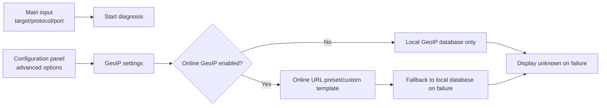

# TracertMonitor Documentation Index

This directory contains human-readable project documentation. The existing `docs/superpowers/` directory remains as an archive for agent specs and implementation plans, not as the daily entry point.

## Project Positioning

TracertMonitor is a fast troubleshooting tool for frontline network engineers to bring onsite when diagnosing customer network issues.

Its core goal is to quickly collect path, TCP port reachability, latency, loss, jitter, and ECMP-branch evidence when a customer reports that a public service is slow, unstable, or intermittently unreachable. The tool should help onsite engineers identify the likely affected path, time window, or hop range.

It is not a continuous monitoring platform or a heavy NMS/observability system. Design should prioritize:

- Single-machine operation.
- Local web cockpit.
- Short diagnostic sessions.
- Fast startup and low deployment cost.
- Complete evidence export.
- Topology nodes show province, city, and carrier metadata to support inter-carrier troubleshooting.
- No multi-user backend, long-term database, or distributed probe system unless later approved as a separate phase.

## Recommended Reading Order

1. [Current Progress](current-progress.md)
2. [Business Flow Design](business-flow.md)
3. [Module Design](modules.md)
4. [Inter-Module Communication](communication.md)

## Documents

| Document | Purpose |
| --- | --- |
| [Current Progress](current-progress.md) | Explains what exists today, what is only demo behavior, and what should happen next. |
| [Business Flow Design](business-flow.md) | Describes the V1 diagnostic flow from an onsite troubleshooting perspective. |
| [Module Design](modules.md) | Explains what `model`, `probe`, `session`, `analyzer`, `server`, and `export` own. |
| [Inter-Module Communication](communication.md) | Explains how modules exchange data and how the web cockpit talks to the backend. |

## 中文

中文版本：

- [文档索引](README.zh-CN.md)
- [当前进度](current-progress.zh-CN.md)
- [业务流程设计](business-flow.zh-CN.md)
- [模块设计](modules.zh-CN.md)
- [模块间通信](communication.zh-CN.md)

## Configuration Panel Constraint

The main input area should keep only the most common onsite fields: target IP/domain, probing protocol, port, and start diagnosis. All other optional controls should live in the configuration panel so the onsite workflow stays lightweight.

The configuration panel should include GeoIP settings:

- Enable online GeoIP lookup, disabled by default.
- Online GeoIP URL template, with built-in presets but user-replaceable.
- Local GeoIP database path.
- Online timeout, cache duration, and whether private/reserved addresses are skipped.
- If online lookup fails, fall back to the local database; if local lookup also fails, display unknown.

Online GeoIP sends hop IPs to a third-party service, so it must be explicitly enabled by the user.

