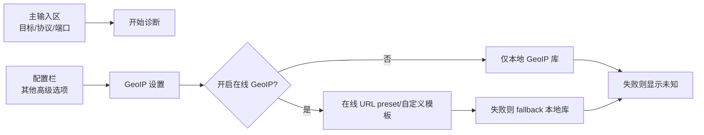

# TracertMonitor 文档索引

这个目录放面向人阅读的项目文档。原来的 `docs/superpowers/` 继续保留为 agent 设计稿和实施计划归档，不作为日常入口。

## 项目定位

TracertMonitor 是给一线网络工程师带到客户现场使用的快速故障诊断工具。

它的核心目标是：在客户反馈访问某个公网业务变慢、不稳定或偶发不可达时，快速采集路径、端口可达性、延迟、丢包、抖动和 ECMP 分支证据，帮助现场人员判断问题大概集中在哪条路径、哪个时间窗口或哪个 hop 区间。

它不是持续监测平台，也不是重型 NMS/可观测性系统。设计上应优先保持：

- 单机运行。
- 本地 Web 驾驶舱。
- 短时间诊断会话。
- 快速启动和低部署成本。
- 完整证据导出。
- 拓扑节点展示省、市、运营商信息，辅助判断互联互通问题。
- 不引入多用户后台、长期数据库、分布式探针等重功能，除非后续明确作为独立阶段。

## 推荐阅读顺序

1. [当前进度](current-progress.zh-CN.md)
2. [业务流程设计](business-flow.zh-CN.md)
3. [模块设计](modules.zh-CN.md)
4. [模块间通信](communication.zh-CN.md)

## 文档说明

| 文档 | 用途 |
| --- | --- |
| [当前进度](current-progress.zh-CN.md) | 说明现在已经做到哪一步、哪些只是 demo、下一步应该做什么。 |
| [下一阶段任务计划](next-task-plan.zh-CN.md) | 单独说明后续任务顺序，以及每个 task 的目标、改动范围、测试和验收标准。 |
| [业务流程设计](business-flow.zh-CN.md) | 从用户现场排障视角描述 V1 诊断流程。 |
| [模块设计](modules.zh-CN.md) | 说明 `model`、`probe`、`session`、`analyzer`、`server`、`export` 各自负责什么。 |
| [模块间通信](communication.zh-CN.md) | 说明模块之间怎么传数据、Web 前后端怎么交互。 |

## English

English versions are available here:

- [Documentation Index](README.md)
- [Current Progress](current-progress.md)
- [Business Flow Design](business-flow.md)
- [Module Design](modules.md)
- [Inter-Module Communication](communication.md)

## 配置栏约束

主输入区只保留现场最常用的目标项：目标 IP/域名、探测协议、端口、开始诊断。其他可选项统一放入配置栏，避免一线人员现场使用时界面过重。

配置栏应包含 GeoIP 设置：

- 是否开启在线 GeoIP 解析，默认关闭。
- 在线 GeoIP URL 模板，内置 preset 但允许替换。
- 本地 GeoIP 库路径。
- 在线查询超时、缓存时间、是否跳过内网/保留地址。
- 在线解析失败后自动 fallback 到本地库，本地库也失败则显示未知。

在线 GeoIP 会把 hop IP 发给第三方服务，因此必须由用户显式开启。

