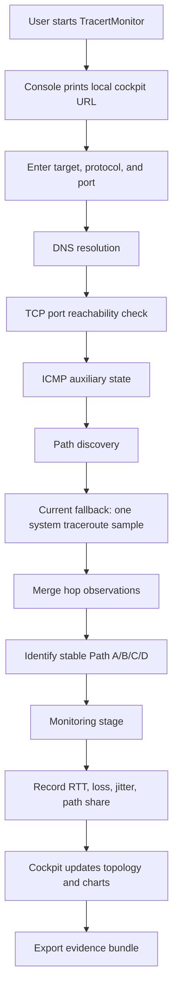

# Business Flow Design

## Goal

TracertMonitor V1 helps onsite network engineers decide whether a slow or unstable public service is related to a specific route, ECMP branch, hop range, or time window.

V1 is TCP-first because real business services often expose TCP ports while UDP and ICMP may be blocked by firewalls, security policy, or carrier equipment. ICMP remains useful, but only as auxiliary evidence.

## Current Implementation Status

As of 2026-07-07:

- The local web cockpit can be served; the program prints `http://127.0.0.1:<port>` to the console. Browser auto-open is not implemented.
- Users can submit target, protocol, and port. The default port is `443`.
- `/api/session/start` converts target/protocol/port/config into `TargetEndpoint` and `DiagnosticConfig`.
- `session` calls `ProbeEngine` for precheck, discovery, analysis, and returns a `DiagnosticSnapshot`.
- The default `SystemProbeEngine` records DNS, TCP port, and ICMP auxiliary state.
- Path discovery still uses one system `tracert.exe` / `traceroute` fallback sampling result; it is not yet Trippy-backed multi-flow, multi-round TTL sweep.
- Analyzer preserves unknown hops, identifies ECMP-shaped paths, and computes window metrics and basic suspicion evidence.
- Export outputs V1 JSON/CSV evidence including target, protocol, port, prechecks, paths, observations, events, and GeoIP source/status.
- GeoIP resolver/fallback semantics exist. Real online provider and local database readers remain future work.

## V1 Main Flow



## Stage Notes

### 1. Startup

The user runs one executable. The program starts a local server on `127.0.0.1` and prints the cockpit URL.

### 2. Target Input

The user provides:

- Domain or IP.
- Protocol, currently mainly `tcp`.
- TCP target port, default `443`.
- Advanced config such as TTL, rounds, probes per TTL, interval, window, and GeoIP options.

Examples:

```text
www.ctyun.cn tcp/443
223.5.5.5 tcp/53
business public IP tcp/custom-port
```

### 3. Precheck

Precheck separates “target itself is unreachable” from “path may be abnormal”.

V1 records:

- DNS resolution result.
- TCP port response.
- ICMP state or unchecked auxiliary status.

Principles:

- TCP established: strong service reachability evidence.
- TCP RST/refused: host responded, port closed; still useful network evidence.
- TCP timeout: could be filtering, packet loss, target unreachable, or policy.
- ICMP failure or unchecked state: not enough to declare TCP service failure.

### 4. Path Discovery

The target shape is:

```text
one discovery round scans TTL 1..N
repeat multiple discovery rounds
use controlled flows where possible
aggregate hop sequences into stable paths
```

Current implementation boundary:

```text
ProbeEngine has discover_paths.
SystemProbeEngine calls system tracert/traceroute fallback.
Real Trippy-backed multi-flow, multi-round TTL sweep is not implemented yet.
```

### 5. ECMP Path Identity

When different flows to the same target traverse different middle hops, the tool should identify separate paths:

```text
Path A: local exit -> Router 1 -> Router 3 -> target
Path B: local exit -> Router 2 -> Router 4 -> target
Path C: local exit -> Router 2 -> Unknown -> target
```

Unknown hops must be preserved. A silent middle hop is not automatically a broken link if later hops or the target respond normally.

### 6. Monitoring

After discovery, the system enters monitoring.

It records:

- hit count per path,
- current window share,
- RTT,
- loss,
- jitter,
- path appearance/disappearance/share changes,
- diagnostic events.

`session.monitor_once` can append observations and refresh metrics. The server has not yet scheduled periodic monitor ticks or added SSE/WebSocket.

### 7. Evidence Export

V1 exports evidence, not unsupported root-cause claims.

Current export includes:

- target, port, protocol,
- DNS/TCP/ICMP prechecks,
- paths,
- hops,
- observations,
- path metrics,
- hop metrics,
- diagnostic events,
- suspicion evidence,
- GeoIP source and status.

## Not In V1

- Distributed probes.
- Long-term database monitoring platform.
- Multi-user backend.
- Automatic customer LAN discovery.
- Electron/Tauri shell.
- Unsupported automatic root-cause claims.

## GeoIP and Carrier Context

Known topology IP nodes should display GeoIP information when possible:

- country/region,
- province,
- city,
- carrier or ASN organization,
- source,
- lookup status.

Example:

```text
TTL 6
IP: 219.x.x.x
Location: Guangdong Guangzhou
Carrier: China Telecom AS4134
Source: local_hit / online_hit / unknown
```

GeoIP helps reason about cross-province routing, cross-carrier interconnects, exit selection, and CDN/anycast placement. It is evidence, not a final conclusion.

## Config Drawer and GeoIP Flow

The main diagnostic entry stays small:

- target IP/domain,
- protocol,
- TCP/UDP port,
- start button.

Advanced controls live in the config drawer:

- max TTL,
- rounds,
- probes per TTL,
- interval,
- window,
- online GeoIP toggle,
- online URL template,
- local GeoIP database path,
- cache TTL.

Online GeoIP must be opt-in. Presets are examples only.