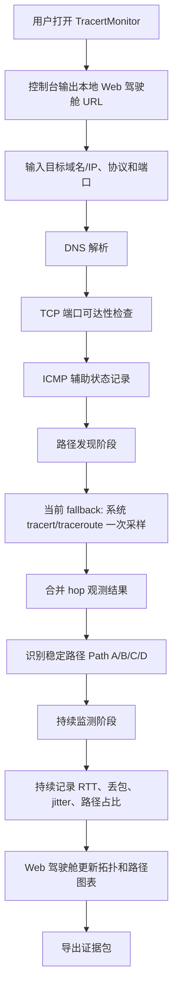
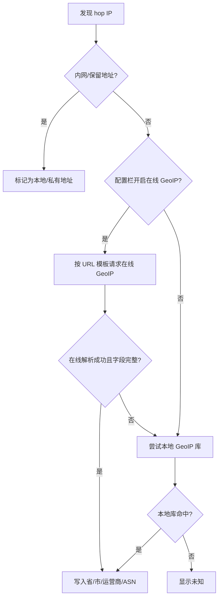

# 业务流程设计

## 目标

TracertMonitor V1 的目标是帮助一线网络工程师在客户现场快速判断：访问某个公网业务目标变慢或不稳定时，问题是否集中在某条路径、某个 ECMP 分支、某段 hop 区间或某个时间窗口。

V1 默认以 **TCP 端口探测** 为主，因为很多真实业务只开放 TCP 端口，UDP 和 ICMP 可能被防火墙、安全策略或运营商设备阻断。ICMP 仍然有价值，但只作为辅助证据。

## 当前实现状态

2026-07-07 的代码状态是：

- 本地 Web 驾驶舱已经能打开，当前程序在控制台打印 `http://127.0.0.1:<port>`，尚未自动拉起浏览器。
- 用户可以输入目标、协议和端口，端口默认 `443`。
- `/api/session/start` 会把 target/protocol/port/config 转成 `TargetEndpoint` 和 `DiagnosticConfig`。
- `session` 会调用 `ProbeEngine` 做 precheck、discovery、analysis，并返回 `DiagnosticSnapshot`。
- 默认 `SystemProbeEngine` 已做 DNS、TCP 端口和 ICMP 辅助状态记录。
- 路径发现当前仍复用系统 `tracert.exe` / `traceroute` fallback 的一次采样结果，不是真正 Trippy-backed 多 flow、多轮 TTL sweep。
- analyzer 已能识别 ECMP 形态、保留 unknown hop、计算窗口占比和基础异常证据。
- export 已能导出 V1 JSON/CSV 证据，包括 target、protocol、port、prechecks、paths、observations、events 和 GeoIP 来源/状态。
- GeoIP resolver/fallback 语义已实现，默认不访问第三方；真实在线 provider 和本地库读取仍待接入。

## V1 主流程



## 阶段说明

### 1. 启动

用户运行单个可执行程序。程序在本机 `127.0.0.1` 启动 Web 服务，并在控制台打印本地访问 URL。

后续可以增加自动打开浏览器、托盘入口或桌面壳，但这些不是当前 V1 证据闭环的前提。

### 2. 输入目标

用户输入：

- 域名或 IP。
- 探测协议，当前主线是 `tcp`。
- TCP 目标端口，默认 `443`。
- 高级配置，例如 TTL 上限、轮数、每 TTL 探测次数、窗口、探测间隔、GeoIP 开关。

示例：

```text
www.ctyun.cn tcp/443
223.5.5.5 tcp/53
业务公网 IP tcp/自定义端口
```

### 3. 预检查

预检查用于区分“目标本身不可达”和“路径中间可能异常”。

V1 至少记录：

- DNS 是否解析成功。
- TCP 端口是否有响应。
- ICMP 是否可达或是否未检查，作为辅助参考。

判断原则：

- TCP 连接建立：业务端口开放，目标服务很可能可达。
- TCP RST/连接拒绝：目标主机有响应，但端口关闭；这仍然是有效网络证据。
- TCP 超时：可能是过滤、丢包、目标不可达或策略阻断。
- ICMP 不通或未检查：不能直接说明 TCP 业务不可达。

### 4. 路径发现

目标形态是：

```text
一轮 discovery 扫描 TTL 1..N
重复多轮 discovery
每轮中尽量使用可控 flow
最后把观测到的 hop 序列聚合成稳定路径
```

当前实现边界是：

```text
ProbeEngine 已有 discover_paths 接口。
SystemProbeEngine 当前仍调用系统 tracert/traceroute fallback。
真实 Trippy-backed 多 flow、多轮 TTL sweep 还没接入。
```

这意味着当前版本已经能把 Web 输入走到 session/probe/analyzer/export，但路径发现深度仍受系统命令能力限制。

### 5. ECMP 路径识别

当相同目标在不同 flow 下经过不同中间 hop 时，工具应识别为多条稳定路径：

```text
Path A: 本地出口 -> Router 1 -> Router 3 -> 目标
Path B: 本地出口 -> Router 2 -> Router 4 -> 目标
Path C: 本地出口 -> Router 2 -> Unknown -> 目标
```

`unknown` hop 必须保留。中间 hop 不响应并不等于链路断了；如果后续 hop 正常响应，它通常只是该设备不回包、限速或被策略限制。

### 6. 持续监测

路径发现完成后，系统进入持续监测阶段。

持续记录：

- 每条路径的命中次数。
- 每条路径在当前时间窗口中的占比。
- RTT。
- 丢包率。
- jitter。
- 路径出现、消失、占比变化。
- 可疑事件。

当前 `session.monitor_once` 已经可以追加观测并刷新窗口指标；server 还没有接后台定时器或 SSE/WebSocket。后续如果要做真正实时监控，应由 server 或更上层定时调用 `monitor_once`，不要在 `probe` 或 `analyzer` 内部偷偷开线程。

### 7. 导出证据

导出应优先保留完整证据，而不是只导出结论。

V1 当前导出：

- 目标、端口、协议。
- DNS/TCP/ICMP 预检查结果。
- 所有路径。
- 所有 hop。
- 所有观测记录。
- 路径级指标。
- hop 级指标。
- 诊断事件。
- 疑似问题路径和证据说明。
- GeoIP 来源和解析状态。

## V1 暂不做

- 分布式探针。
- 长期数据库监控平台。
- 多用户后台。
- 客户内网设备自动发现。
- Electron/Tauri 桌面壳。
- 没有证据支撑的自动根因结论。

## GeoIP 和运营商诉求

拓扑图上的每个已知 IP 节点应尽量展示 GeoIP 信息，至少精确到 **省、市、运营商**。这个诉求用于现场判断互联互通问题，例如跨运营商访问、跨省绕路、出口调度异常、目标侧运营商入口拥塞等。

最低展示字段：

- 国家/地区。
- 省。
- 市。
- 运营商或 ASN 组织。
- 数据来源。
- 解析状态。

推荐节点展示示例：

```text
TTL 6
IP: 219.x.x.x
位置: 广东省 广州市
运营商: 中国电信 AS4134
来源: local_hit / online_hit / unknown
```

排障意义：

- 判断路径是否跨省绕路。
- 判断路径是否从一个运营商切到另一个运营商。
- 判断异常是否集中在跨运营商互联点附近。
- 判断客户所在运营商和目标所在运营商之间是否存在互联互通问题。

GeoIP 信息是证据，不是最终结论。数据库不准、Anycast、CDN 调度、IP 广播和运营商地址分配变化，都可能导致地理信息与真实转发位置不完全一致。

## 配置栏与 GeoIP 解析流程

为了保持现场使用轻量，主诊断入口只放：

- 目标 IP/域名。
- 探测协议。
- TCP/UDP 端口。
- 开始诊断。

其他筛选项和高级项全部放入配置栏，包括：

- TTL 上限。
- 探测轮数。
- 每个 TTL 的探测次数。
- 探测间隔。
- 时间窗口。
- 是否开启在线 GeoIP。
- 在线 GeoIP URL 模板。
- 本地 GeoIP 库路径。
- GeoIP 缓存时间。

GeoIP 解析流程：



内置在线 URL 只能作为 preset，不应默认开启。推荐优先支持可替换 URL 模板，例如：

```text
https://ipapi.co/{ip}/json/
http://ip-api.com/json/{ip}?lang=zh-CN&fields=status,message,country,regionName,city,isp,org,as,query
```

注意：`ip-api.com` 免费端点字段很适合省市和运营商展示，但官方免费端点是 HTTP、限制 45 次/分钟，并声明不允许商业使用；因此只能作为用户可选 preset，不应作为默认开启服务。`ipapi.co` 支持 HTTPS，并提供 city、region、asn、org 字段，可作为更稳妥的内置示例。IPinfo Lite 支持 HTTPS 和 ASN，但免费层主要是国家与 ASN，不能完整满足省市需求。

### 在线 GeoIP provider 参考

这些服务只能作为可选 preset，具体能否用于客户现场、商用场景或离线交付，需要以后按许可证和服务条款再确认：

- [ipapi.co API](https://ipapi.co/api/)：支持 `city`、`region`、`asn`、`org` 等字段，可作为 HTTPS 在线解析示例。
- [ip-api.com JSON API](https://ip-api.com/docs/api:json)：字段包含 `regionName`、`city`、`isp`、`org`、`as`，但免费端点是 HTTP，有 45 次/分钟限制，并声明免费端点不允许商业使用。
- [IPinfo developers](https://ipinfo.io/developers)：Lite API 支持 HTTPS，免费层主要返回国家和 ASN 信息，不完整满足省/市要求。