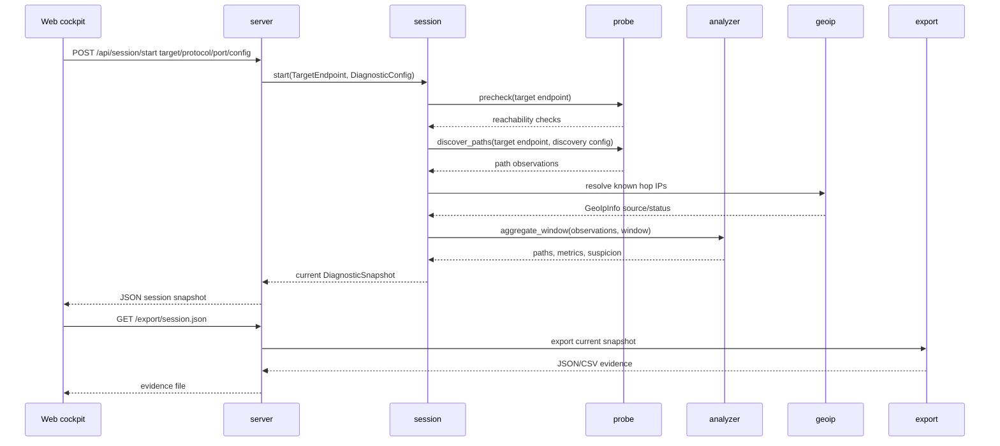
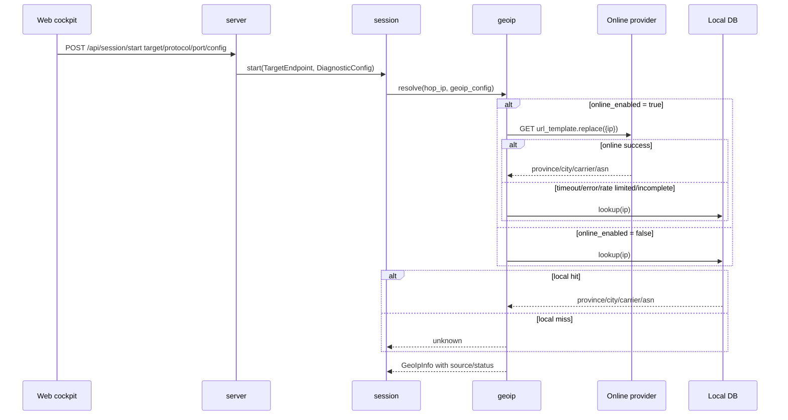

# Module Communication

## Overall Principle

TracertMonitor V1 is a local single-process program, not a distributed system. Internal modules exchange Rust structs through function and method calls. There is no need for queues or RPC at this stage.

The only real protocol boundary is:

```text
browser web cockpit <-> local server
```

V1 uses HTTP + JSON. SSE or WebSocket can be added later if smoother realtime updates are needed.

## Internal Data Flow



## Rust Internal Calls

### `server -> session`

The server receives HTTP requests and passes target/config data to `session`.

Shape:

```text
target: "www.ctyun.cn"
protocol: "tcp"
port: 443
config.discovery.max_ttl: 30
config.discovery.rounds: 3
config.discovery.probes_per_ttl: 3
config.timing.packet_interval_ms: 1000
config.timing.window_seconds: 60
config.geoip.online_enabled: false
```

The server should not decide:

- how TCP precheck works,
- how many TTL rounds to run,
- which path is suspicious,
- how monitoring phase advances,
- whether to call online GeoIP.

### `session -> probe`

The session calls `probe` to collect evidence.

Calls:

```text
precheck(target_endpoint)
discover_paths(target_endpoint, discovery_config)
monitor_once(target_endpoint, known_paths)
```

Returns:

```text
ReachabilityCheck[]
PathObservation[]
```

`ProbeRound`, `FlowKey`, and `TtlProbeSample` are modeled, but probe-round evidence is not yet fully wired into snapshot/export.

### `session -> analyzer`

The session passes observations to the analyzer.

Input:

```text
observations
time_window
```

Output:

```text
paths
path metrics
suspicion
DiagnosticEvent[]
```

### `session -> geoip`

The session calls GeoIP after known hop IPs appear.

Input:

```text
known hop ip
DiagnosticConfig.geoip
```

Output stored in `HopNode::Known.geoip`:

```text
country_or_region
province
city
carrier_or_asn
source
status
```

GeoIP does not participate in path identity or phase transitions.

### `server -> export`

Exports read the current `DiagnosticSnapshot` and pass it to `export`. Export must not re-probe or mutate session state.

## Web API

### Start Diagnostic Session

```http
POST /api/session/start
Content-Type: application/json
```

Request:

```json
{
  "target": "www.ctyun.cn",
  "protocol": "tcp",
  "port": 443,
  "packet_interval_ms": 1000,
  "config": {
    "discovery": {
      "max_ttl": 30,
      "rounds": 3,
      "probes_per_ttl": 3
    },
    "timing": {
      "packet_interval_ms": 1000,
      "window_seconds": 60
    },
    "geoip": {
      "online_enabled": false,
      "preset": "none",
      "url_template": null,
      "local_db_path": null,
      "timeout_ms": 1500,
      "cache_ttl_seconds": 86400,
      "skip_private_or_reserved": true
    }
  }
}
```

Response is a `DiagnosticSnapshot`:

```json
{
  "phase": "monitoring",
  "target": {
    "input": "www.ctyun.cn",
    "resolved": ["203.0.113.10"],
    "protocol": "tcp",
    "port": 443
  },
  "config": {
    "discovery": {
      "max_ttl": 30,
      "rounds": 3,
      "probes_per_ttl": 3
    },
    "timing": {
      "packet_interval_ms": 1000,
      "window_seconds": 60
    },
    "geoip": {
      "online_enabled": false,
      "preset": "none",
      "url_template": null,
      "local_db_path": null,
      "timeout_ms": 1500,
      "cache_ttl_seconds": 86400,
      "skip_private_or_reserved": true
    }
  },
  "started_at": "2026-07-07T00:00:00Z",
  "ended_at": null,
  "prechecks": [
    {
      "checked_at": "2026-07-07T00:00:00Z",
      "kind": "dns",
      "status": "reachable",
      "remote_addr": "203.0.113.10",
      "rtt_ms": null,
      "detail": "1 resolved address(es)"
    },
    {
      "checked_at": "2026-07-07T00:00:00Z",
      "kind": "tcp_port",
      "status": "reachable",
      "remote_addr": "203.0.113.10",
      "rtt_ms": 18.5,
      "detail": "tcp connection established"
    },
    {
      "checked_at": "2026-07-07T00:00:00Z",
      "kind": "icmp_echo",
      "status": "unchecked",
      "remote_addr": "203.0.113.10",
      "rtt_ms": null,
      "detail": "icmp echo is auxiliary and is not checked by the system fallback engine"
    }
  ],
  "paths": [],
  "observations": [],
  "events": []
}
```

The IP and RTT are examples. Real values come from local DNS, TCP, and `tracert/traceroute` results.

### Current Session

```http
GET /api/session
```

Returns the current `DiagnosticSnapshot`.

### Export Evidence

```http
GET /export/session.json
GET /export/prechecks.csv
GET /export/path-summary.csv
GET /export/hop-summary.csv
GET /export/observations.csv
GET /export/events.csv
```

`hop-summary.csv` includes GeoIP source and status fields.

Future routes may include:

```http
GET /export/report.html
GET /export/report.md
```

## Realtime Strategy

V1 can use polling:

```text
browser GET /api/session every 1-3 seconds
```

Later, if needed:

```text
SSE: server -> browser
WebSocket: bidirectional
```

## Error Propagation

Errors that are useful troubleshooting evidence should become session evidence, not disappear as strings.

Examples:

```text
DNS failed -> DiagnosticEvent(kind=DnsChanged or EvidenceInsufficient)
TCP timeout -> ReachabilityCheck(status=BlockedOrFiltered)
ICMP unreachable -> ReachabilityCheck(status=Unreachable), but not immediate critical severity
probe privilege problem -> DiagnosticEvent(kind=EvidenceInsufficient, severity=Warning)
```

Only invalid HTTP requests should be represented only as HTTP 400/500.

## GeoIP Fallback Flow



GeoIP statuses:

```text
online_hit
online_failed_local_hit
local_hit
unknown
skipped_private_or_reserved
```

Online GeoIP failure must never fail the diagnostic session. It only downgrades node location evidence to local or unknown.