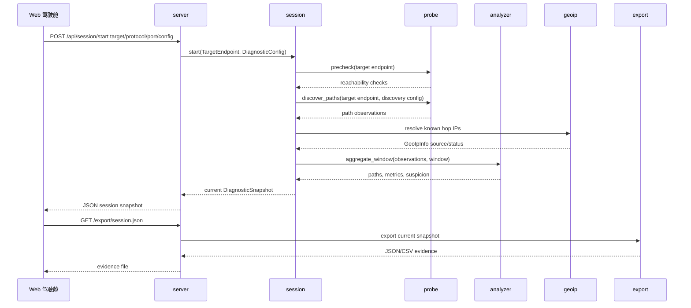
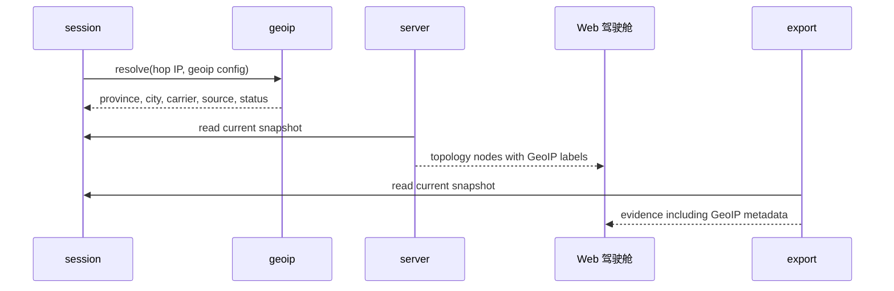
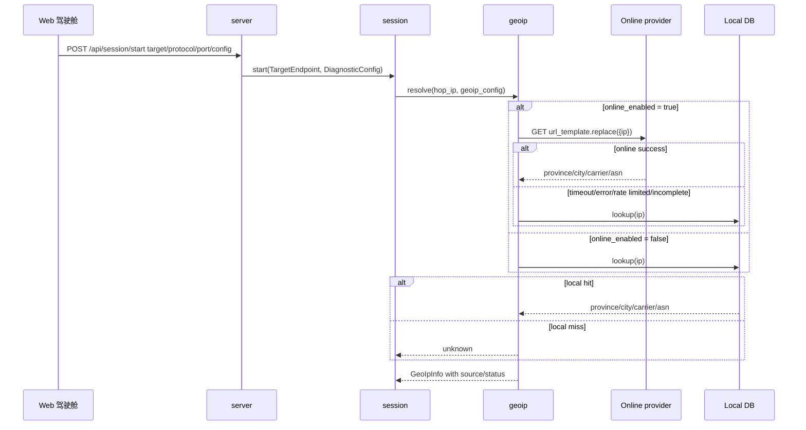

# 模块间通信

## 总体原则

TracertMonitor V1 是本地单进程程序，不是分布式系统。模块之间优先用 Rust 结构体和函数/方法调用传数据，不需要一开始设计复杂消息队列或 RPC。

真正需要“协议”的地方只有一处：

```text
浏览器 Web 驾驶舱 <-> 本地 server
```

这部分 V1 先用 HTTP + JSON，后续实时性要求更高时再加 SSE 或 WebSocket。

## 内部数据流



## Rust 内部通信

### `server -> session`

`server` 接收 HTTP 请求后，把目标配置交给 `session`。

数据形状：

```text
target: "www.ctyun.cn"
protocol: "tcp"
port: 443
config.discovery.max_ttl: 30
config.discovery.rounds: 3
config.discovery.probes_per_ttl: 3
config.timing.packet_interval_ms: 1000
config.timing.window_seconds: 60
config.geoip.online_enabled: false
```

`server` 不应该自己决定：

- 怎么做 TCP 预检查。
- TTL 扫描几轮。
- 哪条路径可疑。
- 监测状态如何推进。
- 是否请求在线 GeoIP。

### `session -> probe`

`session` 调用 `probe` 采集证据。

调用类型：

```text
precheck(target_endpoint)
discover_paths(target_endpoint, discovery_config)
monitor_once(target_endpoint, known_paths)
```

返回类型是结构化证据：

```text
ReachabilityCheck[]
PathObservation[]
```

当前 `SystemProbeEngine` 仍以系统 `tracert/traceroute` fallback 产生 observation；`ProbeRound`、`FlowKey`、`TtlProbeSample` 已建模，但还没有完整导入导出链路。

### `session -> analyzer`

`session` 把已有观测交给 `analyzer`。

输入：

```text
observations
time_window
```

输出：

```text
paths
path metrics
suspicion
DiagnosticEvent[]
```

### `session -> geoip`

`session` 在 discovery 或 monitor 产生已知 hop 后调用 GeoIP resolver 补充展示证据。

输入：

```text
known hop ip
DiagnosticConfig.geoip
```

输出进入 `HopNode::Known.geoip`：

```text
country_or_region
province
city
carrier_or_asn
source
status
```

GeoIP 不参与 path id，也不改变诊断 phase。

### `server -> export`

导出时，`server` 读取当前 session snapshot，然后交给 `export`。

`export` 不应该重新探测，也不应该修改 session。

## Web API 设计

### 启动诊断

```http
POST /api/session/start
Content-Type: application/json
```

请求：

```json
{
  "target": "www.ctyun.cn",
  "protocol": "tcp",
  "port": 443,
  "packet_interval_ms": 1000,
  "config": {
    "discovery": {
      "max_ttl": 30,
      "rounds": 3,
      "probes_per_ttl": 3
    },
    "timing": {
      "packet_interval_ms": 1000,
      "window_seconds": 60
    },
    "geoip": {
      "online_enabled": false,
      "preset": "none",
      "url_template": null,
      "local_db_path": null,
      "timeout_ms": 1500,
      "cache_ttl_seconds": 86400,
      "skip_private_or_reserved": true
    }
  }
}
```

响应是 `DiagnosticSnapshot`：

```json
{
  "phase": "monitoring",
  "target": {
    "input": "www.ctyun.cn",
    "resolved": ["203.0.113.10"],
    "protocol": "tcp",
    "port": 443
  },
  "config": {
    "discovery": {
      "max_ttl": 30,
      "rounds": 3,
      "probes_per_ttl": 3
    },
    "timing": {
      "packet_interval_ms": 1000,
      "window_seconds": 60
    },
    "geoip": {
      "online_enabled": false,
      "preset": "none",
      "url_template": null,
      "local_db_path": null,
      "timeout_ms": 1500,
      "cache_ttl_seconds": 86400,
      "skip_private_or_reserved": true
    }
  },
  "started_at": "2026-07-07T00:00:00Z",
  "ended_at": null,
  "prechecks": [
    {
      "checked_at": "2026-07-07T00:00:00Z",
      "kind": "dns",
      "status": "reachable",
      "remote_addr": "203.0.113.10",
      "rtt_ms": null,
      "detail": "1 resolved address(es)"
    },
    {
      "checked_at": "2026-07-07T00:00:00Z",
      "kind": "tcp_port",
      "status": "reachable",
      "remote_addr": "203.0.113.10",
      "rtt_ms": 18.5,
      "detail": "tcp connection established"
    },
    {
      "checked_at": "2026-07-07T00:00:00Z",
      "kind": "icmp_echo",
      "status": "unchecked",
      "remote_addr": "203.0.113.10",
      "rtt_ms": null,
      "detail": "icmp echo is auxiliary and is not checked by the system fallback engine"
    }
  ],
  "paths": [],
  "observations": [],
  "events": []
}
```

上面的 IP 和 RTT 是示例；真实响应以本机 DNS、TCP 和 `tracert/traceroute` 结果为准。

### 查询当前会话

```http
GET /api/session
```

用途：

- 前端刷新当前拓扑。
- 前端刷新底部路径监控。
- 用户查看当前诊断状态。

响应与 `/api/session/start` 返回的 `DiagnosticSnapshot` 形状一致。

### 导出证据

```http
GET /export/session.json
GET /export/prechecks.csv
GET /export/path-summary.csv
GET /export/hop-summary.csv
GET /export/observations.csv
GET /export/events.csv
```

当前 JSON 导出直接导出当前 `DiagnosticSnapshot`。CSV 导出包含：

```text
prechecks.csv
path-summary.csv
hop-summary.csv
observations.csv
events.csv
```

`hop-summary.csv` 已包含 GeoIP 来源和状态字段。

后续可以增加：

```http
GET /export/report.html
GET /export/report.md
```

## 实时更新策略

V1 可以先用轮询：

```text
浏览器每 1-3 秒 GET /api/session
```

优点：

- 实现简单。
- 容易测试。
- 本地程序压力很小。

后续如果需要更顺滑的实时图表，再升级：

```text
SSE: server -> browser 单向推送
WebSocket: 双向实时通信
```

当前阶段推荐：

```text
先 HTTP 轮询，后续再 SSE。
```

## 错误传递

错误不要只返回字符串，应该转成可展示、可导出的事件。

示例：

```text
DNS 解析失败 -> DiagnosticEvent(kind=DnsChanged 或 EvidenceInsufficient)
TCP 端口超时 -> ReachabilityCheck(status=BlockedOrFiltered)
ICMP 不通 -> ReachabilityCheck(status=Unreachable)，但 severity 不直接升高
探测权限不足 -> DiagnosticEvent(kind=EvidenceInsufficient, severity=Warning)
```

原则：

```text
能作为排障证据的错误，都要记录进 session。
只有 HTTP 请求本身错误，才用 HTTP 400/500 表示。
```

## GeoIP 数据流

路径发现或持续监测得到已知 hop IP 后，`session` 调用 GeoIP 能力补充节点标签。



进入 session snapshot 的数据形状：

```json
{
  "country_or_region": "中国",
  "province": "广东省",
  "city": "广州市",
  "carrier_or_asn": "中国电信 AS4134",
  "source": "local-fixture",
  "status": "local_hit"
}
```

前端拓扑图应优先在节点 hover 或详情面板中展示这些信息，避免节点本身文字过多导致拓扑拥挤。

## 配置栏读取与 GeoIP fallback 通信

配置栏提交时，`server` 把主输入和高级配置一起转成 `DiagnosticConfig` 交给 `session`。主输入区只保留目标、协议、端口；其余筛选项和 GeoIP 设置都来自配置栏。



GeoIP 响应状态：

```text
online_hit
online_failed_local_hit
local_hit
unknown
skipped_private_or_reserved
```

在线 GeoIP 查询失败不能让诊断失败，只能让节点地理信息降级为本地库或未知。