# Current Progress

## One-Line Status

TracertMonitor now has a runnable local web cockpit, deterministic multi-path demo data, system `tracert/traceroute` fallback, V1 target/protocol/port modeling, TCP-first precheck evidence, a `ProbeEngine` boundary, the `session` coordinator, the server start API, ECMP/unknown-hop analysis, monitor ticks, a configuration drawer with `DiagnosticConfig`, JSON/CSV export with prechecks and GeoIP source/status, and frontend wiring for V1 phase, prechecks, port input, and GeoIP node details.

Task 10 was completed on 2026-07-07. The next major work is Trippy-backed probing, scheduled monitor ticks in the server layer, and real GeoIP providers.

## Progress Map

```mermaid
flowchart LR
    A["Done\nstandalone tracertmonitor workspace"] --> B["Done\nweb cockpit demo"]
    B --> C["Done\nsystem tracert fallback"]
    C --> D["Done\nV1 model/probe/session/server"]
    D --> E["Done\nECMP analysis and monitor tick"]
    E --> F["Done\nV1 JSON/CSV export"]
    F --> G["Done\nfrontend V1 phase and port"]
    G --> H["Done\nconfig drawer and DiagnosticConfig"]
    H --> I["Done\nGeoIP resolver/fallback"]
    I --> J["Done\nend-to-end validation and docs"]
    J --> K["Next\nTrippy-backed probe/monitoring"]
```

## What Exists

| Area | Current Status |
| --- | --- |
| Standalone project | `tracertmonitor/` exists as its own workspace, separate from the upstream `trippy/` directory. |
| Vendored Trippy | Required Trippy crates are vendored under `vendor/trippy/` for future reuse. |
| Web cockpit | Embedded HTML/CSS/JS can show demo topology, path monitoring, export links, target/protocol/port input, phase, prechecks, config controls, and GeoIP labels. |
| Target input | Frontend and backend support target/protocol/port; default port is 443. |
| Config drawer | Frontend submits TTL, rounds, probes per TTL, timing window, interval, and GeoIP config; backend applies defaults and clamps values with `DiagnosticConfig`. |
| System traceroute fallback | `probe.rs` can call system `tracert`/`traceroute` for one sampling round. |
| V1 model | `model.rs` includes `TargetEndpoint`, `ProbeProtocol`, `ReachabilityCheck`, `ProbeRound`, `FlowKey`, `TtlProbeSample`, `ProbeResponse`, `DiagnosticConfig`, `GeoIpInfo`, and `GeoIpLookupStatus`. |
| Session coordinator | `session.rs` can run precheck/discovery through `ProbeEngine`, append observations through `monitor_once`, refresh analysis, and attach GeoIP evidence to known hops. |
| Analyzer | `analyzer.rs` can build stable path IDs, preserve unknown hops, identify ECMP paths, aggregate window metrics, and flag basic loss/latency evidence. GeoIP does not participate in path identity. |
| Export | `export.rs` exports old `TraceSession` and V1 `DiagnosticSnapshot` JSON/CSV, including target/protocol/port, prechecks, paths, observations, events, GeoIP source/status, and `prechecks.csv`. |
| Demo data | `demo.rs` provides deterministic multi-path data with unknown hops and suspected path issues. |
| Plans | V1 implementation plans exist under `docs/superpowers/plans/`; `doc/next-task-plan.zh-CN.md` has completed Task 10. |

## Latest Validation

Validation completed on 2026-07-07:

| Check | Result |
| --- | --- |
| `node --check apps/tracertmonitor/src/assets/app.js` | Passed with exit code 0. |
| `cargo test -p tracertmonitor --lib` | Passed, 41/41 tests. |
| `cargo run -p tracertmonitor` | Starts and prints the local cockpit URL. |
| Local HTTP smoke | `GET /`, `POST /api/session/start`, and `GET /export/session.json` returned 200. |
| Smoke target | `www.ctyun.cn`, `tcp`, `443`. |
| Smoke response | phase `monitoring`, 3 prechecks, 1 path, 1 observation, 2 events; exported JSON includes target, prechecks, paths, observations, and events. |

## Still Missing

| Gap | Notes |
| --- | --- |
| Trippy-backed probe | Vendored crates are ready, but the active probe engine is still the system fallback plus stable interfaces. |
| Real multi-round TTL sweep | Interfaces and analyzer semantics exist, but active probing does not yet run real multi-flow, multi-round ECMP discovery. |
| Background timer / realtime push | `session.monitor_once` exists, but the server does not yet schedule it; SSE/WebSocket is not implemented. |
| Real GeoIP providers | Resolver/provider/fallback semantics exist. Real HTTP provider and local database reader remain future work. |
| Longer visual field validation | Local HTTP smoke and asset checks passed; longer visual click-throughs should be repeated on real field networks. |

## Module Status

| Module | Status | Next Step |
| --- | --- | --- |
| `main.rs` | Starts the server with demo data and prints a local URL. | Optional browser auto-open or desktop shell. |
| `server.rs` | Local HTTP, static assets, APIs, exports; start API accepts target/protocol/port/config and delegates to `session`. | Add scheduled monitor ticks or realtime push. |
| `probe.rs` | System traceroute fallback, `ProbeEngine`, TCP/DNS/ICMP prechecks. | Add Trippy-backed multi-round discovery/monitoring. |
| `model.rs` | Shared evidence types, V1 endpoint/precheck/probe round/config/GeoIP types. | Extend as real providers require. |
| `geoip.rs` | Resolver/provider interfaces, private/reserved skip, online-failure-to-local fallback, unknown downgrade. | Add real HTTP and local database providers. |
| `analyzer.rs` | ECMP identification, unknown-hop preservation, window share, loss/latency evidence. | Extend rules with real probe evidence. |
| `export.rs` | V1 JSON/CSV export with prechecks and GeoIP source/status. | Add probe round evidence when it enters snapshots. |
| `demo.rs` | Multi-path demo data. | Keep for UI, tests, and offline demos. |
| `session.rs` | `ProbeEngine` and GeoIP integration, start/discovery/monitor tick, snapshots and events. | Let server schedule monitor ticks. |