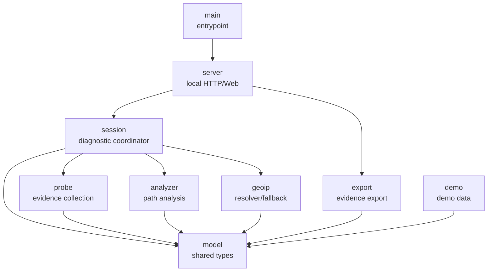

# Module Design

## Design Principles

The basic version stays as one Rust application crate. Boundaries are kept clear first; splitting into more crates can wait until the product shape is stable.

The module rules are:

- `model` defines shared language.
- `probe` collects evidence and does not diagnose.
- `session` coordinates one diagnostic lifecycle.
- `analyzer` interprets observations into paths and suspicion evidence.
- `geoip` enriches known hops with location/carrier display evidence.
- `server` only owns local Web/API concerns.
- `export` only exports existing evidence.
- `demo` only provides demo/test data.

## Module Graph



## Responsibilities

| Module | Owns | Does Not Own |
| --- | --- | --- |
| `main` | Start the server and initial session. | Business logic or probing. |
| `model` | Targets, ports, protocols, paths, hops, metrics, events, windows, config, GeoIP types. | Analysis, network access, HTTP. |
| `probe` | DNS/TCP/ICMP prechecks, traceroute fallback, raw observations. | Path diagnosis or UI data. |
| `session` | Precheck, discovery, monitoring, stop, analysis refresh, GeoIP attachment. | HTTP parsing or rendering. |
| `analyzer` | Stable Path A/B/C/D, metrics, unknown-hop preservation, suspicion evidence. | Sending probes, timers, files. |
| `geoip` | Location/carrier lookup and online/local/unknown fallback. | Path identity or fault diagnosis. |
| `server` | Local page, API, export routes. | Direct probing or path diagnosis. |
| `export` | JSON/CSV/report export. | Re-probing or mutating session state. |
| `demo` | Fixed multipath data for UI and tests. | Real diagnostics. |

## Current File Layout

```text
apps/tracertmonitor/src/
  main.rs       entrypoint
  lib.rs        module exports
  model.rs      shared data structures
  probe.rs      probe interface and collection implementation
  session.rs    diagnostic runtime coordinator
  analyzer.rs   path aggregation and anomaly analysis
  geoip.rs      GeoIP resolver/provider/fallback
  server.rs     local HTTP/Web API
  export.rs     evidence export
  demo.rs       demo data
```

## Why `session` Exists

The real workflow needs a coordinator:

```text
start
 -> precheck
 -> discovery rounds
 -> analysis
 -> monitoring ticks
 -> export
```

`server` now delegates `/api/session/start` to `DiagnosticSession::start_with_probe`; it does not decide the probing flow itself.

## Dependency Rules

```text
model depends on no business module.
probe may depend on model.
analyzer may depend on model.
geoip may depend on model.
session may depend on model, probe, analyzer, geoip.
server may depend on session and export.
export may depend on model and session/analyzer output.
demo may depend on model and analyzer, but not on the real runtime path.
```

The key rules:

```text
server should not decide how probing works.
probe should not decide what is faulty.
analyzer should not decide when to probe.
geoip should not decide whether a path is faulty.
```

## Current Probe Boundary

`ProbeEngine` currently exposes:

```text
precheck
discover_paths
monitor_once
```

The default implementation is `SystemProbeEngine`:

- `precheck` records DNS, TCP port, and ICMP auxiliary state.
- `discover_paths` still calls system `tracert.exe` or `traceroute` fallback.
- `monitor_once` currently reuses one discovery result.

This means the V1 evidence loop works, but real Trippy-backed multi-flow, multi-round TTL sweep is still future work.

## GeoIP Boundary

`geoip.rs` enriches known hop IPs with province/city/carrier or ASN data.

Current responsibility:

```text
input: IP address + GeoIpConfig
output: country/region, province, city, carrier/ASN, source, status
```

GeoIP is display evidence only. It does not change path IDs and does not decide whether a link is faulty.

Dependency direction:

```text
session -> geoip -> model
server reads GeoIP from session snapshots
export reads GeoIP from session snapshots
```

`geoip` already uses provider-style boundaries:

```text
GeoIpResolver
  -> OnlineGeoIpProvider
  -> LocalGeoIpProvider
  -> Unknown fallback
```

The default providers do not call third parties and do not read a real local database yet; they provide tested fallback semantics.

## Config and GeoIP Design

`DiagnosticConfig` currently lives in `model` and is passed to `session` at start time.

Current fields:

```text
DiagnosticConfig
  discovery.max_ttl
  discovery.rounds
  discovery.probes_per_ttl
  timing.packet_interval_ms
  timing.window_seconds
  geoip.online_enabled
  geoip.preset
  geoip.url_template
  geoip.local_db_path
  geoip.timeout_ms
  geoip.cache_ttl_seconds
  geoip.skip_private_or_reserved
```

Responsibilities:

- `server` reads the config drawer but does not request online GeoIP.
- `session` decides when to call the GeoIP resolver.
- `geoip` performs online/local/unknown fallback.
- `analyzer` may display GeoIP evidence but cannot diagnose by carrier/city alone.
- `export` must include GeoIP source and status.