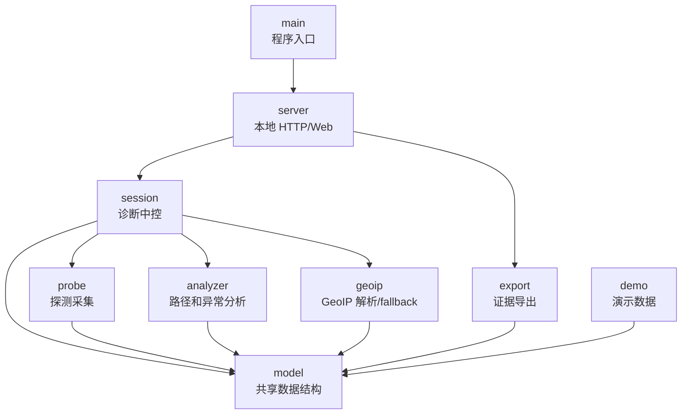
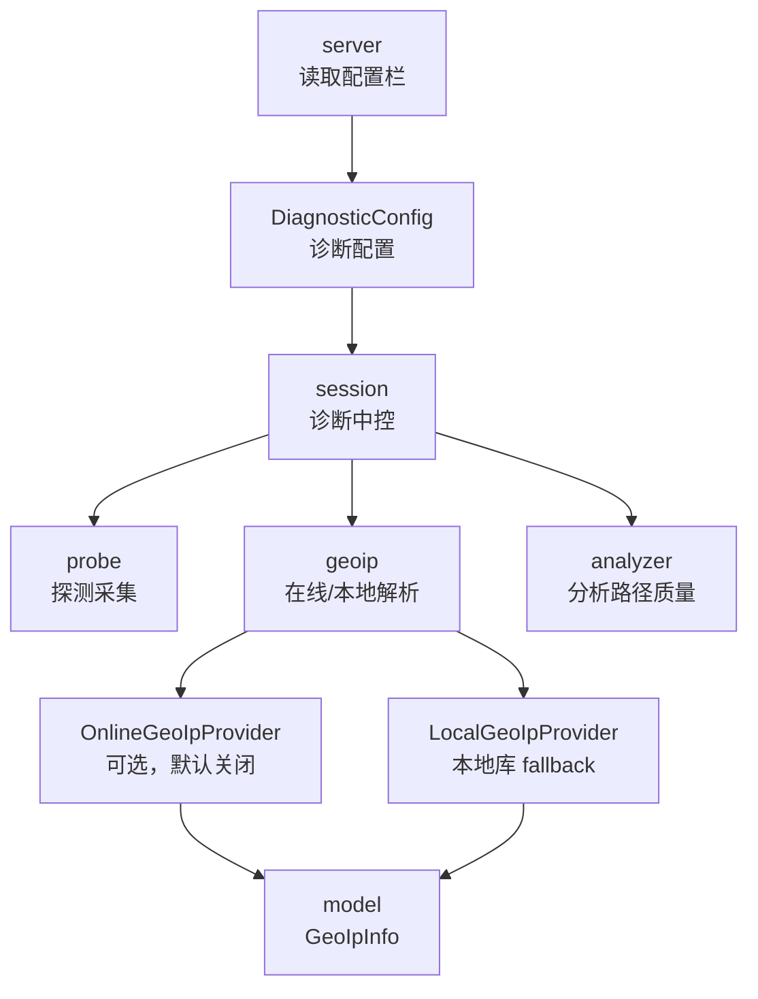

# 模块设计

## 设计原则

基础版先保持一个 Rust 应用 crate，不急着拆成多个 crate。模块先按职责拆清楚，等代码规模变大、边界稳定后，再考虑拆 crate。

模块设计遵循：

- `model` 定义系统语言。
- `probe` 只采集证据，不做诊断结论。
- `session` 组织一次诊断，是运行时中控。
- `analyzer` 解释观测，生成路径和异常证据。
- `geoip` 给已知 hop 补充地理/运营商展示证据。
- `server` 只负责本地 Web/API。
- `export` 只负责导出已有证据。
- `demo` 只提供演示和测试数据。

## 模块图



## 模块职责

| 模块 | 职责 | 不负责 |
| --- | --- | --- |
| `main` | 启动程序，组装 server 和初始 session。 | 不写业务逻辑，不做探测。 |
| `model` | 定义目标、端口、协议、路径、hop、指标、事件、时间窗口、配置、GeoIP 等数据结构。 | 不做分析，不访问网络，不处理 HTTP。 |
| `probe` | DNS/TCP/ICMP 预检查，TTL 探测 fallback，生成原始观测。 | 不判断哪条路径有问题，不生成 UI 数据。 |
| `session` | 管理一次诊断的生命周期：预检查、发现、监测、停止、刷新分析、挂载 GeoIP。 | 不直接解析 HTTP，不直接渲染页面。 |
| `analyzer` | 聚合观测，生成稳定 Path A/B/C/D，计算指标和可疑证据。 | 不发包，不调度定时器，不写文件。 |
| `geoip` | 根据配置解析已知 hop 的国家/地区、省、市、运营商/ASN，并处理在线失败到本地/未知的降级。 | 不参与 path id，不判断链路故障。 |
| `server` | 提供本地页面、API、导出入口。 | 不直接发探测包，不自己判断路径异常。 |
| `export` | 导出 JSON/CSV/后续报告。 | 不重新探测，不改变会话状态。 |
| `demo` | 提供固定多路径数据，支持 UI 和测试。 | 不作为真实探测来源。 |

## 当前文件结构

```text
apps/tracertmonitor/src/
  main.rs       程序入口
  lib.rs        模块导出
  model.rs      共享数据结构
  probe.rs      探测接口和采集实现
  session.rs    诊断运行时中控
  analyzer.rs   路径聚合和异常分析
  geoip.rs      GeoIP resolver/provider/fallback
  server.rs     本地 HTTP/Web API
  export.rs     证据导出
  demo.rs       演示数据
```

## 为什么需要 `session`

真实流程需要：

```text
start
 -> precheck
 -> discovery rounds
 -> analysis
 -> monitoring ticks
 -> export
```

这些步骤需要一个中控模块保存状态、调度探测、调用分析器、维护当前快照。这个中控就是 `session`。

当前 `server` 已经把 `/api/session/start` 交给 `DiagnosticSession::start_with_probe`，不再由 server 自己决定探测流程。

## 依赖规则

```text
model 不依赖其他业务模块。
probe 可以依赖 model。
analyzer 可以依赖 model。
geoip 可以依赖 model。
session 可以依赖 model、probe、analyzer、geoip。
server 可以依赖 session 和 export。
export 可以依赖 model 和 session/analyzer 的输出。
demo 可以依赖 model 和 analyzer，但不能参与真实运行路径。
```

最重要的一条：

```text
server 不应该直接决定怎么探测。
probe 不应该直接决定怎么诊断。
analyzer 不应该直接决定什么时候探测。
geoip 不应该直接决定路径是否异常。
```

这样后面修改真实探测、异常判断、Web 展示或导出时，不会互相缠住。

## 当前探测边界

当前已经有 `ProbeEngine` trait，包含：

```text
precheck
discover_paths
monitor_once
```

当前默认实现是 `SystemProbeEngine`：

- `precheck` 会记录 DNS、TCP 端口和 ICMP 辅助状态。
- `discover_paths` 仍调用系统 `tracert.exe` 或 `traceroute` fallback。
- `monitor_once` 当前复用一次 discovery 结果。

因此现在已经跑通了 V1 证据闭环，但还不是最终形态的 Trippy-backed 多 flow、多轮 TTL sweep。

## GeoIP 模块边界

当前已有 `geoip.rs`，用来给拓扑图中的已知 hop IP 补充省、市、运营商或 ASN 组织信息。

当前职责：

```text
geoip
  输入: IP 地址 + GeoIpConfig
  输出: 国家/地区、省、市、运营商/ASN、数据来源、解析状态
```

它只负责补充节点标签证据，不负责判断链路是否故障，也不应该改变 path id。路径是否异常仍然由 `analyzer` 根据延迟、丢包、jitter、路径占比和时间窗口证据判断。

模块依赖方向：

```text
session -> geoip -> model
server 读取 session snapshot 后展示 GeoIP 标签
export 读取 session snapshot 后导出 GeoIP 证据
```

`geoip` 当前已经是 provider 风格：

```text
GeoIpResolver
  -> OnlineGeoIpProvider
  -> LocalGeoIpProvider
  -> Unknown fallback
```

当前默认 provider 不访问第三方，也不读取真实本地库；它主要提供可测试的 fallback 语义。真实 HTTP provider 和本地 MMDB/数据库读取仍是后续任务。

## 配置与 GeoIP 模块设计

为了避免主界面过重，当前已有 `DiagnosticConfig`。基础版先不单独成 crate，只作为 `model` 中的配置结构和 `session` 启动参数；后续复杂后再拆成 `config.rs`。

当前配置结构负责：

```text
DiagnosticConfig
  discovery.max_ttl
  discovery.rounds
  discovery.probes_per_ttl
  timing.packet_interval_ms
  timing.window_seconds
  geoip.online_enabled
  geoip.preset
  geoip.url_template
  geoip.local_db_path
  geoip.timeout_ms
  geoip.cache_ttl_seconds
  geoip.skip_private_or_reserved
```

模块关系：



职责边界：

- `server` 只读取配置栏，不直接请求在线 GeoIP。
- `session` 根据配置决定是否调用 GeoIP resolver。
- `geoip` 执行在线、本地、未知 fallback。
- `analyzer` 可以读取 GeoIP 证据辅助展示，但不能只因为某运营商/城市就判定故障。
- `export` 必须导出 GeoIP 来源和解析状态，方便说明证据可信度。