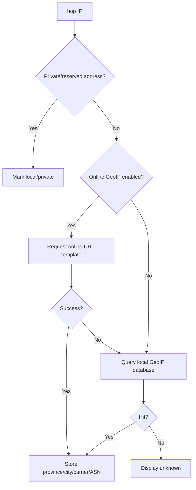

# V1 Diagnostic Flow Implementation Plan

> **For agentic workers:** REQUIRED SUB-SKILL: Use superpowers:subagent-driven-development (recommended) or superpowers:executing-plans to implement this plan task-by-task. Steps use checkbox (`- [ ]`) syntax for tracking.

**Goal:** Build the first real diagnostic flow for TracertMonitor: open the local web cockpit, accept a target IP/domain plus TCP port, run reachability checks, discover ECMP paths, continuously monitor each path, and record evidence.

**Architecture:** Keep the current single Rust application crate. Add a `session` module as the runtime coordinator, keep `model` as the shared vocabulary, keep `probe` behind a probe interface, keep `analyzer` responsible for path aggregation and suspicion evidence, and keep `server` responsible for local HTTP/Web UI only. V1 uses TCP-port probing as the primary path because many real services block UDP and ICMP, while ICMP remains auxiliary evidence.

**Tech Stack:** Rust, vendored Trippy crates, current embedded HTML/CSS/vanilla JavaScript cockpit, JSON/CSV export.

---

## Current Status

The current application already has these pieces:

- `apps/tracertmonitor/src/main.rs` starts a local server with demo data.
- `apps/tracertmonitor/src/server.rs` serves the web cockpit, accepts `/api/session/start`, resolves targets, and currently calls one probe function.
- `apps/tracertmonitor/src/probe.rs` runs one system `tracert`/`traceroute` command and converts its output into a `TraceSession`.
- `apps/tracertmonitor/src/model.rs` defines the current session, target, path, hop, metrics, event, and time-window types.
- `apps/tracertmonitor/src/analyzer.rs` creates stable path IDs, aggregates observations into a time window, and flags basic loss suspicion.
- `apps/tracertmonitor/src/export.rs` exports JSON and CSV evidence.
- `apps/tracertmonitor/src/demo.rs` creates deterministic multi-path demo data for UI work.

The missing V1 runtime is a real diagnostic flow:

- Target input should include domain/IP plus TCP port.
- The tool should run reachability checks before traceroute-style probing.
- Path discovery should run multiple TTL sweeps and multiple probe rounds.
- ECMP paths should be identified as stable Path A/B/C/D entries.
- Continuous monitoring should keep sampling discovered paths and hop metrics.
- Raw observations, analysis snapshots, and diagnostic events should be recorded for export.

## Confirmed V1 User Flow

```text
User opens TracertMonitor
 -> Local web cockpit opens automatically or prints a local URL
 -> User enters target IP/domain and TCP port
 -> Tool resolves DNS if needed
 -> Tool checks TCP port reachability
 -> Tool optionally checks ICMP reachability as auxiliary evidence
 -> Tool enters path discovery
 -> Each discovery round scans TTL 1..N
 -> Each TTL is probed multiple times and across controlled flows
 -> Tool merges hop observations into an initial topology
 -> Analyzer identifies stable paths: Path A, Path B, Path C, Path D
 -> Tool enters continuous monitoring
 -> Tool samples each discovered path and hop over time
 -> Cockpit updates topology and per-path charts
 -> Tool records raw observations, path metrics, hop metrics, and events
 -> User exports evidence package
```

Important correction to the rough flow:

```text
Do not finish all ttl=1 probes, then all ttl=2 probes, then all ttl=3 probes as independent phases.
Instead, one discovery round should sweep ttl=1..N, and the system should repeat that sweep across rounds and flows.
```

That shape is closer to traceroute and makes it easier to reconstruct complete paths.

## Probe Policy

V1 defaults:

- Primary protocol: TCP traceroute-style probing.
- Required user input: target domain/IP and TCP destination port.
- Default TCP port: 443.
- ICMP: optional reachability reference, not the main success condition.
- UDP: not a V1 default because many business targets and security policies block it.
- Intermediate hop signal: ICMP TTL exceeded responses from routers.
- Target signal: TCP SYN-ACK, TCP RST, timeout, or other reachable/unreachable evidence.

Network meaning:

- TCP port open means the business-facing service is likely reachable.
- TCP port closed with RST can still prove the target host responded.
- ICMP unreachable does not automatically mean the TCP service is unreachable.
- A middle hop that does not answer does not automatically mean the path is broken if later hops answer.
- A run of unknown hops through the target needs to be recorded as evidence, not hidden.

## Module Responsibilities

```text
main
 -> server
 -> session
 -> probe
 -> analyzer
 -> model

export reads session/model/analyzer output.
demo remains isolated test and UI data.
```

`model` defines the shared language:

- Target endpoint.
- Probe protocol and TCP port.
- Reachability checks.
- Probe round.
- Flow identity.
- TTL sample.
- Path observation.
- Stable path evidence.
- Hop evidence.
- Time window.
- Analysis snapshot.
- Diagnostic event.

`probe` gathers evidence:

- DNS resolution result.
- TCP reachability result.
- ICMP reachability result when enabled.
- TTL-limited probe samples.
- Per-round path observations.

`session` coordinates one diagnostic run:

- Accept target configuration from `server`.
- Run prechecks.
- Run path discovery.
- Store observations.
- Call `analyzer`.
- Continue monitoring on a timer.
- Expose the latest session state to `server`.

`analyzer` interprets observations:

- Create stable path IDs.
- Merge repeated observations into Path A/B/C/D.
- Preserve unknown hops.
- Calculate path share, RTT, loss, jitter, and hit count.
- Detect suspicious paths and evidence-insufficient cases.

`server` exposes the local cockpit:

- Serve embedded frontend assets.
- Accept start/stop/session API requests.
- Return the latest session snapshot as JSON.
- Return export endpoints.
- Avoid direct probing logic.

`export` writes evidence:

- JSON complete session evidence.
- CSV path summary.
- CSV hop summary.
- CSV observations.
- CSV events.
- Later: human-readable Markdown/HTML summary.

## File Structure

- Modify: `apps/tracertmonitor/src/model.rs`
  - Add V1 endpoint, protocol, precheck, flow, probe round, TTL sample, and analysis snapshot types.
- Create: `apps/tracertmonitor/src/session.rs`
  - Coordinate precheck, discovery, monitoring, analyzer calls, and current state.
- Modify: `apps/tracertmonitor/src/lib.rs`
  - Export the new `session` module.
- Modify: `apps/tracertmonitor/src/probe.rs`
  - Split one-shot system traceroute behavior from the future probe interface.
  - Add TCP-precheck and TTL-probe vocabulary.
- Modify: `apps/tracertmonitor/src/analyzer.rs`
  - Aggregate path observations from discovery/monitoring rounds.
  - Keep stable path identity across repeated observations.
- Modify: `apps/tracertmonitor/src/server.rs`
  - Accept target plus TCP port.
  - Call `session` instead of directly calling `probe`.
- Modify: `apps/tracertmonitor/src/export.rs`
  - Include prechecks, probe rounds, and snapshots in export output.
- Modify: `apps/tracertmonitor/src/assets/index.html`
  - Ensure the input form includes target and TCP port.
- Modify: `apps/tracertmonitor/src/assets/app.js`
  - Send target and port to `/api/session/start`.
  - Render precheck/discovery/monitoring state.
- Modify: `apps/tracertmonitor/src/assets/styles.css`
  - Style the target/port controls and status states.
- Keep: `apps/tracertmonitor/src/demo.rs`
  - Continue providing deterministic multi-path demo data.

---

### Task 1: Expand The Shared Data Model

**Files:**
- Modify: `apps/tracertmonitor/src/model.rs`

- [ ] **Step 1: Add a failing model serialization test**

Add a test that creates a session with target `example.com`, TCP port `443`, one TCP reachability result, one ICMP auxiliary result, and one TTL sample.

Run:

```powershell
cargo test -p tracertmonitor --lib model::tests::serializes_v1_target_precheck_and_probe_round
```

Expected before implementation:

```text
FAIL because the V1 model types do not exist yet.
```

- [ ] **Step 2: Add V1 target and probe types**

Add these concepts to `model.rs`:

```rust
pub struct TargetEndpoint {
    pub input: String,
    pub resolved: Vec<IpAddr>,
    pub port: Option<u16>,
    pub protocol: ProbeProtocol,
}

pub enum ProbeProtocol {
    Tcp,
    Icmp,
}

pub struct ReachabilityCheck {
    pub checked_at: DateTime<Utc>,
    pub kind: ReachabilityKind,
    pub status: ReachabilityStatus,
    pub message: String,
}

pub enum ReachabilityKind {
    Dns,
    TcpPort,
    IcmpEcho,
}

pub enum ReachabilityStatus {
    Reachable,
    Unreachable,
    BlockedOrFiltered,
    NotChecked,
}
```

Keep the existing `Target` during migration, but make the new endpoint type the direction for V1.

- [ ] **Step 3: Add flow and TTL sample types**

Add these concepts:

```rust
pub struct FlowKey {
    pub protocol: ProbeProtocol,
    pub source_port: Option<u16>,
    pub destination_port: Option<u16>,
    pub flow_label: Option<String>,
}

pub struct TtlProbeSample {
    pub observed_at: DateTime<Utc>,
    pub ttl: u8,
    pub flow: FlowKey,
    pub node: HopNode,
    pub rtt_ms: Option<f64>,
    pub response: ProbeResponse,
}

pub enum ProbeResponse {
    TtlExceeded,
    TcpSynAck,
    TcpReset,
    IcmpEchoReply,
    Timeout,
    OtherIcmp,
}
```

- [ ] **Step 4: Run the focused test**

Run:

```powershell
cargo test -p tracertmonitor --lib model::tests::serializes_v1_target_precheck_and_probe_round
```

Expected:

```text
PASS
```

---

### Task 2: Add A Session Coordinator

**Files:**
- Create: `apps/tracertmonitor/src/session.rs`
- Modify: `apps/tracertmonitor/src/lib.rs`

- [ ] **Step 1: Add a failing session lifecycle test**

Add a test that starts a diagnostic session for `example.com:443`, runs precheck with a fake probe engine, records a path-discovery observation, and exposes a current snapshot.

Run:

```powershell
cargo test -p tracertmonitor --lib session::tests::session_runs_precheck_discovery_and_snapshot
```

Expected before implementation:

```text
FAIL because session.rs does not exist yet.
```

- [ ] **Step 2: Create session state**

Create `session.rs` with these responsibilities:

```rust
pub enum DiagnosticPhase {
    Idle,
    Precheck,
    Discovering,
    Monitoring,
    Stopped,
    Failed,
}

pub struct DiagnosticSession {
    pub phase: DiagnosticPhase,
    pub trace: TraceSession,
}
```

Add methods that make the flow explicit:

```rust
impl DiagnosticSession {
    pub fn start_precheck(&mut self) { /* set phase and append events */ }
    pub fn record_observation(&mut self, observation: PathObservation) { /* store observation */ }
    pub fn refresh_analysis(&mut self, window: TimeWindow) { /* call analyzer */ }
    pub fn stop(&mut self) { /* set ended_at and phase */ }
}
```

- [ ] **Step 3: Export the module**

Modify `lib.rs`:

```rust
pub mod session;
```

- [ ] **Step 4: Run the session test**

Run:

```powershell
cargo test -p tracertmonitor --lib session::tests::session_runs_precheck_discovery_and_snapshot
```

Expected:

```text
PASS
```

---

### Task 3: Define The Probe Interface And Prechecks

**Files:**
- Modify: `apps/tracertmonitor/src/probe.rs`
- Test: `apps/tracertmonitor/src/probe.rs`

- [ ] **Step 1: Add failing tests for TCP-first precheck behavior**

Add tests for:

- Literal IP target preserves the IP and TCP port.
- Domain target records DNS result.
- TCP port open/closed/filtered is represented as evidence.
- ICMP failure does not fail the whole session when TCP is usable.

Run:

```powershell
cargo test -p tracertmonitor --lib probe::tests::tcp_precheck_is_primary_and_icmp_is_auxiliary
```

Expected before implementation:

```text
FAIL because the TCP-first precheck interface does not exist.
```

- [ ] **Step 2: Introduce a probe engine boundary**

Add a trait-shaped interface in `probe.rs`:

```rust
pub trait ProbeEngine {
    fn precheck(&mut self, target: &TargetEndpoint) -> Result<Vec<ReachabilityCheck>, ProbeError>;
    fn discover_paths(&mut self, target: &TargetEndpoint, config: &DiscoveryConfig) -> Result<Vec<PathObservation>, ProbeError>;
    fn monitor_once(&mut self, target: &TargetEndpoint, paths: &[PathId]) -> Result<Vec<PathObservation>, ProbeError>;
}
```

Add:

```rust
pub struct DiscoveryConfig {
    pub max_ttl: u8,
    pub rounds: usize,
    pub probes_per_ttl: usize,
}
```

Use conservative V1 defaults:

```rust
max_ttl = 30
rounds = 3
probes_per_ttl = 3
```

- [ ] **Step 3: Keep the current system traceroute as fallback**

Do not delete the existing `probe_session_for_target` path yet. Wrap it as legacy/fallback behavior so the application still has a working path while the Trippy-backed engine is added later.

- [ ] **Step 4: Run probe tests**

Run:

```powershell
cargo test -p tracertmonitor --lib probe::tests
```

Expected:

```text
PASS
```

---

### Task 4: Implement Path Discovery Semantics

**Files:**
- Modify: `apps/tracertmonitor/src/probe.rs`
- Modify: `apps/tracertmonitor/src/analyzer.rs`
- Test: `apps/tracertmonitor/src/analyzer.rs`

- [ ] **Step 1: Add a failing ECMP discovery test**

Create observations where TTL 1 is the same, TTL 2 branches to two different routers, and the destination is the same. Assert that analyzer produces Path A and Path B with stable IDs.

Run:

```powershell
cargo test -p tracertmonitor --lib analyzer::tests::ecmp_discovery_creates_stable_paths
```

Expected before implementation:

```text
FAIL if analyzer cannot preserve multiple ECMP branches from repeated discovery rounds.
```

- [ ] **Step 2: Make the discovery rule explicit**

Document in code comments and tests:

```text
One discovery round sweeps ttl=1..max_ttl.
The system repeats discovery rounds across controlled flows.
Path identity is built from ordered hop evidence, preserving unknown hops.
```

- [ ] **Step 3: Preserve unknown hops**

Ensure unknown hops remain in `stable_path_id` and topology data. A non-answering intermediate hop is informational when later hops answer.

- [ ] **Step 4: Run analyzer tests**

Run:

```powershell
cargo test -p tracertmonitor --lib analyzer::tests
```

Expected:

```text
PASS
```

---

### Task 5: Wire Server Start Requests Through Session

**Files:**
- Modify: `apps/tracertmonitor/src/server.rs`
- Modify: `apps/tracertmonitor/src/assets/index.html`
- Modify: `apps/tracertmonitor/src/assets/app.js`
- Modify: `apps/tracertmonitor/src/assets/styles.css`

- [ ] **Step 1: Add a failing server API test**

Update the start route test so the request includes both target and port:

```json
{"target":"www.ctyun.cn","port":443,"packet_interval_ms":1000}
```

Assert the response contains the target, port, and precheck evidence.

Run:

```powershell
cargo test -p tracertmonitor --lib server::tests::start_route_accepts_target_and_tcp_port
```

Expected before implementation:

```text
FAIL because the start request does not yet model port and precheck evidence.
```

- [ ] **Step 2: Update request parsing**

Extend `StartSessionRequest`:

```rust
struct StartSessionRequest {
    target: String,
    port: Option<u16>,
    packet_interval_ms: Option<u64>,
}
```

Validation:

- Empty target returns HTTP 400.
- Missing port defaults to 443.
- Port 0 returns HTTP 400.
- Ports above 65535 cannot be represented as `u16`, so invalid JSON returns HTTP 400.

- [ ] **Step 3: Route through session**

Replace direct server-to-probe orchestration with server-to-session orchestration. `server` should not decide how discovery or monitoring works.

- [ ] **Step 4: Update frontend input**

The first screen should allow:

- Target domain/IP.
- TCP port.
- Start button.
- Current phase display: precheck, discovering, monitoring, failed.

- [ ] **Step 5: Run server tests**

Run:

```powershell
cargo test -p tracertmonitor --lib server::tests
```

Expected:

```text
PASS
```

---

### Task 6: Add Continuous Monitoring State

**Files:**
- Modify: `apps/tracertmonitor/src/session.rs`
- Modify: `apps/tracertmonitor/src/analyzer.rs`
- Modify: `apps/tracertmonitor/src/server.rs`

- [ ] **Step 1: Add a failing monitoring test**

Use a fake probe engine that returns Path A twice and Path B once. Assert that the session enters `Monitoring`, stores all observations, and analyzer calculates path share.

Run:

```powershell
cargo test -p tracertmonitor --lib session::tests::monitoring_records_path_share_over_time
```

Expected before implementation:

```text
FAIL because monitoring state is not implemented.
```

- [ ] **Step 2: Add monitor tick behavior**

Implement one monitor tick as a synchronous unit first:

```rust
pub fn monitor_once(&mut self, engine: &mut impl ProbeEngine) -> Result<(), ProbeError>
```

The method should:

- Ask the probe engine for new observations.
- Append observations to the session.
- Recalculate the active time window.
- Append diagnostic events when path loss or latency crosses thresholds.

- [ ] **Step 3: Keep timer/threading separate**

Do not mix thread management into analyzer or probe. If server later starts a background loop, it should call session methods rather than duplicating logic.

- [ ] **Step 4: Run session tests**

Run:

```powershell
cargo test -p tracertmonitor --lib session::tests
```

Expected:

```text
PASS
```

---

### Task 7: Expand Evidence Export

**Files:**
- Modify: `apps/tracertmonitor/src/export.rs`
- Test: `apps/tracertmonitor/src/export.rs`

- [ ] **Step 1: Add a failing export completeness test**

Assert JSON export contains:

- Target port.
- Protocol.
- Reachability checks.
- Observations.
- Paths.
- Events.

Run:

```powershell
cargo test -p tracertmonitor --lib export::tests::json_export_contains_v1_diagnostic_flow_evidence
```

Expected before implementation:

```text
FAIL because V1 precheck and protocol evidence are not exported.
```

- [ ] **Step 2: Add CSV coverage**

Add or extend CSV tables so evidence can be reviewed outside the UI:

- `prechecks.csv`
- `path-summary.csv`
- `hop-summary.csv`
- `observations.csv`
- `events.csv`

- [ ] **Step 3: Run export tests**

Run:

```powershell
cargo test -p tracertmonitor --lib export::tests
```

Expected:

```text
PASS
```

---

### Task 8: End-To-End Verification

**Files:**
- Test only.

- [ ] **Step 1: Run JavaScript syntax check**

Run:

```powershell
node --check apps/tracertmonitor/src/assets/app.js
```

Expected:

```text
No syntax errors.
```

- [ ] **Step 2: Run focused Rust tests**

Run:

```powershell
cargo test -p tracertmonitor --lib
```

Expected:

```text
All library tests pass.
```

- [ ] **Step 3: Run the application**

Run:

```powershell
cargo run -p tracertmonitor
```

Expected:

```text
The program prints a local cockpit URL such as http://127.0.0.1:<port>.
```

- [ ] **Step 4: Manual V1 smoke test**

In the web cockpit:

- Enter target `www.ctyun.cn`.
- Enter port `443`.
- Start diagnosis.
- Confirm precheck status appears.
- Confirm discovery/monitoring phase appears.
- Confirm topology and path monitor update from collected or fallback observations.
- Export JSON and CSV evidence.

Expected:

```text
The exported evidence includes target, port, protocol, precheck evidence, paths, hops, observations, and events.
```

## Self-Review Notes

- This plan records the confirmed product flow before implementation.
- The plan keeps Rust as the core product path because Trippy is Rust and Windows single-exe delivery is important.
- The plan keeps TCP as the V1 primary protocol and ICMP as auxiliary evidence.
- The plan preserves the current runnable demo/fallback path while introducing a real `session` coordinator.
- The plan intentionally avoids distributed probes, long-term storage, authentication, Electron/Tauri, and multi-user backend scope.

## Plan Addendum: Configuration Panel And GeoIP Fallback

The main input area should keep only target IP/domain, protocol, port, and start diagnosis. All other filters and advanced settings should move into the configuration panel, including max TTL, discovery rounds, probes per TTL, probe interval, time window, online GeoIP toggle, online URL template, local GeoIP database path, timeout, and cache settings.

GeoIP lookup order:



Online GeoIP is disabled by default because it sends onsite hop IPs to a third-party service. Built-in online URLs are presets only and must be user-replaceable. Online failure must not fail diagnosis; it only falls back to local database lookup or unknown.

