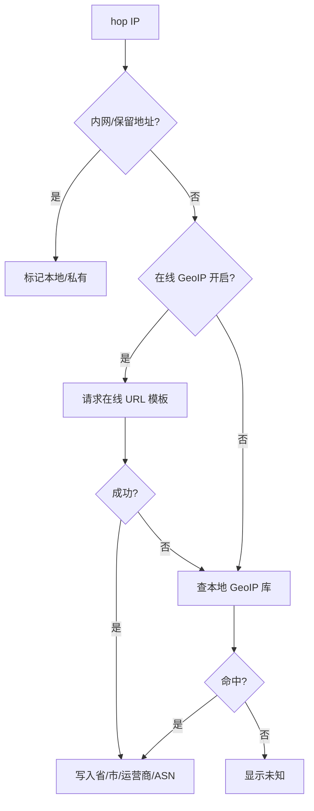

# V1 诊断流程实施计划

> **给后续 agent / 开发者看的说明：** 如果要执行这份计划，请使用 `superpowers:subagent-driven-development`（推荐）或 `superpowers:executing-plans`，按任务逐项推进。任务使用 checkbox（`- [ ]`）语法标记进度；本文中已完成步骤以 `- [x]` 表示。

**目标：** 做出 TracertMonitor 第一版真实诊断流程：打开本地 Web 驾驶舱，输入目标 IP/域名和 TCP 端口，先做可达性检查，再发现 ECMP 多路径，随后持续监测每条路径并记录证据。

**架构方向：** 继续保持当前单个 Rust 应用 crate，不急着拆成很多 crate。新增 `session` 模块作为诊断运行时中控；`model` 作为统一数据语言；`probe` 负责探测证据采集；`analyzer` 负责路径聚合和异常判断；`server` 只负责本地 HTTP/Web 接口；`export` 负责导出证据。V1 默认以 TCP 端口探测为主，因为很多真实业务会禁 UDP 和 ICMP；ICMP 只作为辅助参考。

**技术栈：** Rust、vendored Trippy crates、当前内嵌 HTML/CSS/原生 JavaScript 驾驶舱、JSON/CSV 导出。

---


## 2026-07-07 收口状态

Task 10 已完成。当前代码已经跑通从 Web/API 输入到 `session`、`probe`、`analyzer`、`export` 的 V1 证据闭环；`node --check apps/tracertmonitor/src/assets/app.js` 通过，`cargo test -p tracertmonitor --lib` 通过 41/41，本地 HTTP 冒烟中 `GET /`、`POST /api/session/start`、`GET /export/session.json` 均返回 200。

当前仍需后续推进的是 Trippy-backed 真实多 flow、多轮 TTL sweep、server 后台定时 monitor tick、真实在线/本地 GeoIP provider 和更长时间的现场可视化验证。

## 当前做到哪一步

当前程序已经有这些基础：

- `apps/tracertmonitor/src/main.rs`：启动本地服务，目前默认加载 demo 数据。
- `apps/tracertmonitor/src/server.rs`：提供 Web 页面，支持 `/api/session/start`，能解析目标并调用一次探测。
- `apps/tracertmonitor/src/probe.rs`：目前调用系统 `tracert`/`traceroute`，把命令输出转成 `TraceSession`。
- `apps/tracertmonitor/src/model.rs`：已有会话、目标、路径、hop、指标、事件、时间窗口等基础数据结构。
- `apps/tracertmonitor/src/analyzer.rs`：已有稳定 path id、时间窗口聚合、基础丢包可疑判断。
- `apps/tracertmonitor/src/export.rs`：已有 JSON 和 CSV 导出。
- `apps/tracertmonitor/src/demo.rs`：提供固定多路径 demo 数据，方便 UI 开发和测试。

Task 10 收口后，V1 诊断运行流程已经形成当前可运行闭环：Web/API 输入 target/protocol/port/config，server 交给 session，session 调用 ProbeEngine 做 precheck/discovery/analysis，前端展示 phase/precheck/path，export 导出 JSON/CSV 证据。当前 discovery 仍是系统 `tracert/traceroute` fallback，不是最终 Trippy-backed 多 flow 探测。

## 确认后的 V1 用户流程

```text
用户打开 TracertMonitor
 -> 控制台输出本地 Web 驾驶舱 URL
 -> 用户输入目标 IP/域名和 TCP 端口
 -> 工具解析 DNS（如果输入的是域名）
 -> 工具检查 TCP 端口可达性
 -> 工具可选检查 ICMP 可达性，作为辅助证据
 -> 进入路径发现阶段
 -> 每一轮发现都扫描 TTL 1..N
 -> 每个 TTL 做多次探测，并尽量覆盖不同 flow
 -> 工具把 hop 观测结果合并成初始拓扑图
 -> 分析器识别稳定路径：Path A、Path B、Path C、Path D
 -> 进入持续监测阶段
 -> 持续采样每条路径和 hop 的状态
 -> Web 驾驶舱更新拓扑图和每条路径的监控图
 -> 工具记录原始观测、路径指标、hop 指标和事件
 -> 用户导出证据包
```

一个重要修正：

```text
不要把流程理解为：先把 ttl=1 全部测完，再把 ttl=2 全部测完，再把 ttl=3 全部测完。
更合适的方式是：一次发现轮次扫描 ttl=1..N，然后重复多轮扫描，并用不同 flow 观察 ECMP 分支。
```

这样更接近 traceroute 的工作方式，也更容易还原完整路径。

## 探测策略

V1 默认策略：

- 主协议：TCP traceroute 式探测。
- 用户必须输入：目标域名/IP 和 TCP 目标端口。
- 默认 TCP 端口：443。
- ICMP：可选辅助检查，不作为唯一成功/失败依据。
- UDP：V1 不作为默认方式，因为很多业务和安全策略会阻断 UDP。
- 中间 hop 判断：主要依赖路由器返回 ICMP TTL exceeded。
- 目标 hop 判断：根据 TCP SYN-ACK、TCP RST、超时等证据判断。

网络含义：

- TCP 端口开放，通常说明业务服务可达。
- TCP 返回 RST，也能证明目标主机有响应，只是端口关闭。
- ICMP 不通，不等于 TCP 业务不可达。
- 中间 hop 不响应，不等于链路断了；如果后续 hop 正常响应，它更可能是禁 ping、限速或不回 TTL exceeded。
- 如果从某个 TTL 开始一直到目标都无响应，需要记录为证据，但不要凭空下结论。

## 模块职责

整体依赖方向：

```text
main
 -> server
 -> session
 -> probe
 -> analyzer
 -> model

export 读取 session/model/analyzer 的结果。
demo 只保留为演示和测试数据来源。
```

`model`：统一数据语言。

它定义系统里反复出现的“名词”：

- 目标 endpoint。
- 探测协议和 TCP 端口。
- 可达性检查。
- 探测轮次。
- flow 身份。
- TTL 样本。
- 路径观测。
- 稳定路径证据。
- hop 证据。
- 时间窗口。
- 分析快照。
- 诊断事件。

`probe`：负责采集证据。

它应该负责：

- DNS 解析结果。
- TCP 端口可达性结果。
- ICMP 可达性结果。
- TTL 限制探测样本。
- 每轮路径观测结果。

它不应该负责判断哪条路径有问题。

`session`：负责组织一次诊断。

它是下一步最关键的新模块，负责：

- 接收 `server` 传来的目标配置。
- 执行预检查。
- 执行路径发现。
- 保存观测结果。
- 调用 `analyzer`。
- 按定时器进入持续监测。
- 把当前会话状态暴露给 `server`。

`analyzer`：负责解释观测。

它应该负责：

- 生成稳定 path id。
- 把重复观测聚合成 Path A/B/C/D。
- 保留 unknown hop。
- 计算路径占比、RTT、丢包、jitter、命中次数。
- 判断疑似异常路径。
- 处理证据不足的情况。

`server`：负责本地驾驶舱接口。

它应该负责：

- 提供内嵌前端页面。
- 接收开始、停止、查询会话等 API 请求。
- 返回最新 session snapshot。
- 返回导出接口。

它不应该直接决定怎么探测。

`export`：负责导出证据。

V1 至少包含：

- 完整 JSON 会话证据。
- CSV 路径摘要。
- CSV hop 摘要。
- CSV 观测记录。
- CSV 事件记录。
- 后续再加 Markdown/HTML 人类可读报告。

## 文件规划

- 修改：`apps/tracertmonitor/src/model.rs`
  - 增加 V1 endpoint、protocol、precheck、flow、probe round、TTL sample、analysis snapshot 等类型。
- 新增：`apps/tracertmonitor/src/session.rs`
  - 负责预检查、路径发现、持续监测、调用 analyzer、保存当前状态。
- 修改：`apps/tracertmonitor/src/lib.rs`
  - 导出新的 `session` 模块。
- 修改：`apps/tracertmonitor/src/probe.rs`
  - 把当前一次性系统 traceroute 和未来 probe interface 分开。
  - 增加 TCP 预检查和 TTL 探测相关概念。
- 修改：`apps/tracertmonitor/src/analyzer.rs`
  - 聚合路径发现和持续监测产生的 path observations。
  - 保持 path id 稳定。
- 修改：`apps/tracertmonitor/src/server.rs`
  - 接收目标和 TCP 端口。
  - 调用 `session`，不要再直接调用 `probe`。
- 修改：`apps/tracertmonitor/src/export.rs`
  - 导出预检查、探测轮次、分析快照等证据。
- 修改：`apps/tracertmonitor/src/assets/index.html`
  - 输入表单包含目标和 TCP 端口。
- 修改：`apps/tracertmonitor/src/assets/app.js`
  - 向 `/api/session/start` 发送目标和端口。
  - 展示预检查、路径发现、持续监测状态。
- 修改：`apps/tracertmonitor/src/assets/styles.css`
  - 补充目标/端口输入和状态样式。
- 保留：`apps/tracertmonitor/src/demo.rs`
  - 继续作为确定性的多路径 demo 数据。

---

### 任务 1：扩展共享数据模型

**文件：**
- 修改：`apps/tracertmonitor/src/model.rs`

- [x] **步骤 1：先写失败测试**

增加一个测试：创建目标 `example.com:443`，包含一次 TCP 可达性结果、一次 ICMP 辅助检查结果，以及一个 TTL 样本。

运行：

```powershell
cargo test -p tracertmonitor --lib model::tests::serializes_v1_target_precheck_and_probe_round
```

预期：

```text
失败，因为 V1 数据类型还不存在。
```

- [x] **步骤 2：增加 V1 目标和探测类型**

需要表达这些概念：

```text
TargetEndpoint      目标，包含输入、解析地址、端口、协议
ProbeProtocol       Tcp / Icmp
ReachabilityCheck   可达性检查结果
ReachabilityKind    DNS / TCP端口 / ICMP Echo
ReachabilityStatus  可达 / 不可达 / 被阻断或过滤 / 未检查
```

迁移期可以保留已有 `Target`，但 V1 新逻辑应逐步转向 `TargetEndpoint`。

- [x] **步骤 3：增加 flow 和 TTL 样本类型**

需要表达这些概念：

```text
FlowKey             用来区分 ECMP flow 的身份
TtlProbeSample      某个 TTL 上的一次探测样本
ProbeResponse       TTL exceeded / SYN-ACK / RST / Echo Reply / Timeout / 其他 ICMP
```

- [x] **步骤 4：运行测试**

运行：

```powershell
cargo test -p tracertmonitor --lib model::tests::serializes_v1_target_precheck_and_probe_round
```

预期：

```text
通过。
```

---

### 任务 2：新增 Session 中控模块

**文件：**
- 新增：`apps/tracertmonitor/src/session.rs`
- 修改：`apps/tracertmonitor/src/lib.rs`

- [x] **步骤 1：先写失败测试**

测试内容：启动一个 `example.com:443` 诊断会话，用 fake probe engine 完成预检查，记录一次路径发现观测，然后拿到当前 snapshot。

运行：

```powershell
cargo test -p tracertmonitor --lib session::tests::session_runs_precheck_discovery_and_snapshot
```

预期：

```text
失败，因为 session.rs 还不存在。
```

- [x] **步骤 2：创建 session 状态**

核心状态：

```text
DiagnosticPhase:
  Idle
  Precheck
  Discovering
  Monitoring
  Stopped
  Failed

DiagnosticSession:
  phase
  trace
```

核心方法：

```text
start_precheck      进入预检查阶段并记录事件
record_observation  写入一次路径观测
refresh_analysis    调用 analyzer 刷新分析结果
stop                结束会话
```

- [x] **步骤 3：导出模块**

在 `lib.rs` 中增加：

```rust
pub mod session;
```

- [x] **步骤 4：运行测试**

运行：

```powershell
cargo test -p tracertmonitor --lib session::tests::session_runs_precheck_discovery_and_snapshot
```

预期：

```text
通过。
```

---

### 任务 3：定义 Probe 接口和预检查

**文件：**
- 修改：`apps/tracertmonitor/src/probe.rs`

- [x] **步骤 1：先写 TCP 优先的失败测试**

测试内容：

- 目标是 IP 时保留 IP 和 TCP 端口。
- 目标是域名时记录 DNS 结果。
- TCP 端口 open / closed / filtered 都要表达成证据。
- ICMP 失败时，如果 TCP 可用，不应该让整个会话失败。

运行：

```powershell
cargo test -p tracertmonitor --lib probe::tests::tcp_precheck_is_primary_and_icmp_is_auxiliary
```

预期：

```text
失败，因为 TCP 优先的 precheck interface 还不存在。
```

- [x] **步骤 2：引入 ProbeEngine 边界**

需要一个接口表达：

```text
precheck        做 DNS/TCP/ICMP 预检查
discover_paths  做路径发现
monitor_once    做一次持续监测采样
```

基础发现配置：

```text
max_ttl = 30
rounds = 3
probes_per_ttl = 3
```

- [x] **步骤 3：保留当前系统 traceroute fallback**

暂时不要删除现在的 `probe_session_for_target`。  
它可以作为 legacy/fallback 路径，保证应用在真实 Trippy probe 接入前仍然可运行。

- [x] **步骤 4：运行 probe 测试**

运行：

```powershell
cargo test -p tracertmonitor --lib probe::tests
```

预期：

```text
通过。
```

---

### 任务 4：实现路径发现语义

**文件：**
- 修改：`apps/tracertmonitor/src/probe.rs`
- 修改：`apps/tracertmonitor/src/analyzer.rs`

- [x] **步骤 1：先写 ECMP 发现失败测试**

构造观测数据：

```text
TTL 1 相同
TTL 2 分叉到两个不同路由器
目标相同
```

断言 analyzer 能生成稳定的 Path A 和 Path B。

运行：

```powershell
cargo test -p tracertmonitor --lib analyzer::tests::ecmp_discovery_creates_stable_paths
```

预期：

```text
如果 analyzer 还不能保留多条 ECMP 分支，则失败。
```

- [x] **步骤 2：明确路径发现规则**

规则写入测试和必要注释：

```text
一次 discovery round 扫描 ttl=1..max_ttl。
系统通过多轮 discovery round 和不同 flow 发现 ECMP。
path identity 基于有序 hop evidence，并保留 unknown hop。
```

- [x] **步骤 3：保留 unknown hop**

unknown hop 必须保留在 path id 和拓扑数据里。  
如果中间 hop 不响应但后续 hop 正常响应，它应被标记为信息性节点，而不是直接判断链路故障。

- [x] **步骤 4：运行 analyzer 测试**

运行：

```powershell
cargo test -p tracertmonitor --lib analyzer::tests
```

预期：

```text
通过。
```

---

### 任务 5：Server 开始请求接入 Session

**文件：**
- 修改：`apps/tracertmonitor/src/server.rs`
- 修改：`apps/tracertmonitor/src/assets/index.html`
- 修改：`apps/tracertmonitor/src/assets/app.js`
- 修改：`apps/tracertmonitor/src/assets/styles.css`

- [x] **步骤 1：先写 Server API 失败测试**

请求内容：

```json
{"target":"www.ctyun.cn","port":443,"packet_interval_ms":1000}
```

断言响应包含：

- 目标。
- 端口。
- 预检查证据。

运行：

```powershell
cargo test -p tracertmonitor --lib server::tests::start_route_accepts_target_and_tcp_port
```

预期：

```text
失败，因为 start request 还没有建模 port 和 precheck evidence。
```

- [x] **步骤 2：更新请求解析**

`StartSessionRequest` 需要包含：

```text
target
port
packet_interval_ms
```

校验规则：

- target 为空，返回 HTTP 400。
- port 缺失，默认 443。
- port 为 0，返回 HTTP 400。
- 超过 65535 的端口无法解析为 `u16`，非法 JSON 返回 HTTP 400。

- [x] **步骤 3：通过 session 组织流程**

`server` 不再直接决定探测流程。  
它应该把请求交给 `session`，由 `session` 协调 precheck、discovery、monitoring。

- [x] **步骤 4：更新前端输入**

首屏至少包含：

- 目标域名/IP 输入。
- TCP 端口输入。
- 开始按钮。
- 当前阶段显示：precheck、discovering、monitoring、failed。

- [x] **步骤 5：运行 Server 测试**

运行：

```powershell
cargo test -p tracertmonitor --lib server::tests
```

预期：

```text
通过。
```

---

### 任务 6：增加持续监测状态

**文件：**
- 修改：`apps/tracertmonitor/src/session.rs`
- 修改：`apps/tracertmonitor/src/analyzer.rs`
- 修改：`apps/tracertmonitor/src/server.rs`

- [x] **步骤 1：先写持续监测失败测试**

用 fake probe engine 返回：

```text
Path A 两次
Path B 一次
```

断言：

- session 进入 `Monitoring`。
- 所有 observations 被保存。
- analyzer 算出路径占比。

运行：

```powershell
cargo test -p tracertmonitor --lib session::tests::monitoring_records_path_share_over_time
```

预期：

```text
失败，因为 monitoring 状态还没实现。
```

- [x] **步骤 2：实现一次 monitor tick**

先做同步方法：

```text
monitor_once
```

它应该：

- 向 probe engine 要新的 observations。
- 追加 observations。
- 重新计算当前时间窗口。
- 当丢包或延迟超过阈值时记录诊断事件。

- [x] **步骤 3：不要把线程/定时器混进 analyzer 或 probe**

后续如果 server 启动后台循环，也应该调用 session 方法。  
不要在 analyzer/probe 里各自偷偷开线程。

- [x] **步骤 4：运行 session 测试**

运行：

```powershell
cargo test -p tracertmonitor --lib session::tests
```

预期：

```text
通过。
```

---

### 任务 7：扩展证据导出

**文件：**
- 修改：`apps/tracertmonitor/src/export.rs`

- [x] **步骤 1：先写导出完整性失败测试**

断言 JSON 导出包含：

- 目标端口。
- 协议。
- 可达性检查。
- observations。
- paths。
- events。

运行：

```powershell
cargo test -p tracertmonitor --lib export::tests::json_export_contains_v1_diagnostic_flow_evidence
```

预期：

```text
失败，因为 V1 precheck 和 protocol evidence 还没有导出。
```

- [x] **步骤 2：增加 CSV 覆盖**

导出表建议包含：

- `prechecks.csv`
- `path-summary.csv`
- `hop-summary.csv`
- `observations.csv`
- `events.csv`

- [x] **步骤 3：运行 export 测试**

运行：

```powershell
cargo test -p tracertmonitor --lib export::tests
```

预期：

```text
通过。
```

---

### 任务 8：端到端验证

**文件：**
- 只做测试和手工验证。

- [x] **步骤 1：检查 JavaScript 语法**

运行：

```powershell
node --check apps/tracertmonitor/src/assets/app.js
```

预期：

```text
没有语法错误。
```

- [x] **步骤 2：运行 Rust library 测试**

运行：

```powershell
cargo test -p tracertmonitor --lib
```

预期：

```text
全部通过。
```

- [x] **步骤 3：运行应用**

运行：

```powershell
cargo run -p tracertmonitor
```

预期：

```text
程序输出本地驾驶舱 URL，例如 http://127.0.0.1:<port>。
```

- [x] **步骤 4：手工 V1 冒烟测试**

在 Web 驾驶舱中：

- 输入目标 `www.ctyun.cn`。
- 输入端口 `443`。
- 点击开始诊断。
- 确认显示预检查状态。
- 确认显示 discovery/monitoring 阶段。
- 确认拓扑和路径监控能从采集或 fallback 数据更新。
- 导出 JSON 和 CSV 证据。

预期：

```text
导出的证据包含目标、端口、协议、预检查证据、paths、hops、observations 和 events。
```

## 自检结论

- 这份计划先记录业务流程，不直接改代码。
- Rust 继续作为主线，因为 Trippy 是 Rust，Windows 单 exe 交付也更适合 Rust。
- V1 以 TCP 端口探测为主，ICMP 只作为辅助证据。
- 新增 `session` 模块是下一步核心，因为当前代码缺少真正的诊断中控。
- 当前 demo/fallback 路径需要保留，避免真实 Trippy probe 接入前程序不可用。
- 暂时不做分布式探针、长期数据库、多用户后台、Electron/Tauri、复杂权限系统。

## 计划补充：配置栏与 GeoIP fallback

主输入区只保留目标 IP/域名、协议、端口和开始诊断。其他筛选项和高级项全部放入配置栏，包括 TTL 上限、探测轮数、每 TTL 探测次数、探测间隔、时间窗口、GeoIP 在线解析开关、在线 URL 模板、本地 GeoIP 库路径、超时和缓存设置。

GeoIP 解析顺序：



在线 GeoIP 默认关闭，因为会把客户现场路径中的 hop IP 发给第三方服务。内置在线 URL 只能作为 preset，用户可以替换。在线失败不能导致诊断失败，只能降级到本地库或未知。


